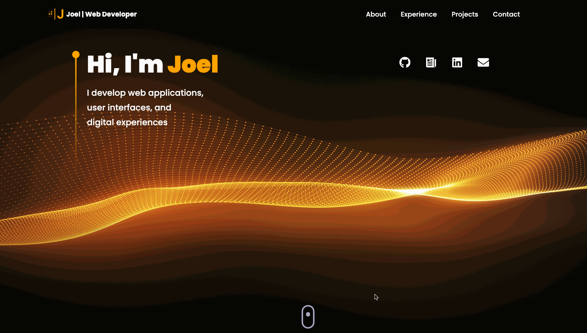

# Portfolio 2

## Table of Contents

- [About](#about)
- [Features](#features)
- [Tech Stack](#tech-stack)
- [Preview](#preview)
- [Quick Start](#quick-start)

## About

Welcome to my current developer portfolio! This project blends technology and creativity, showcasing immersive web experiences, 3D implementation, and dynamic animations. From customizable 3D models to framer motion animations, each section highlights skills and achievements of my web development path so far. The 3D skills section merges three.js and react three fiber, while responsive design ensures optimal viewing. My portfolio goes beyond showcasing skills, offering an immersive experience resonating with creativity and the potential of web development.

Check out the live link to my portfolio [here!](https://jagan-creator.vercel.app/)

https://jagan-creator.vercel.app/

## Features

- Interactive smooth scroll between each section
- 3D models for built for both skills and contact section
- Functional contact integration with EmailJS
- Responsive design for all device sizes including mobile
- Timeline breakdown of my experience with simplistic design

## Tech Stack

- React.js
- Three.js
- Vite
- Tailwind
- Email JS
- React Three Fiber
- React Three Drei

## Preview

### Interactive Scroll & Dynamic Show Cards

- Users can navigate with ease and are presented with interactive "tilt" cards



### Timeline Breakdown

- Here you will find my experience and skills presented in a modern timeline format


### Projects Showcase

- Dynamic project cards linked with associated github repositories of projects I have completed and feel proud to present


### Email JS Contact Form

- Simplistic contact form for users to reach out and also presented with an earth 3D model


## Quick Start

1. **Prerequisites:**

   - Git
   - Node.js
   - npm

2. **Installation:**

To install and run Crypto Monitor locally, follow these steps:

```bash
# Clone the repository
git clone https://github.com/Jagan-creator/Portfolio-2

# Navigate to the project directory
cd Portfolio-2

# Install dependencies
npm install

# Run the application
npm start
```
